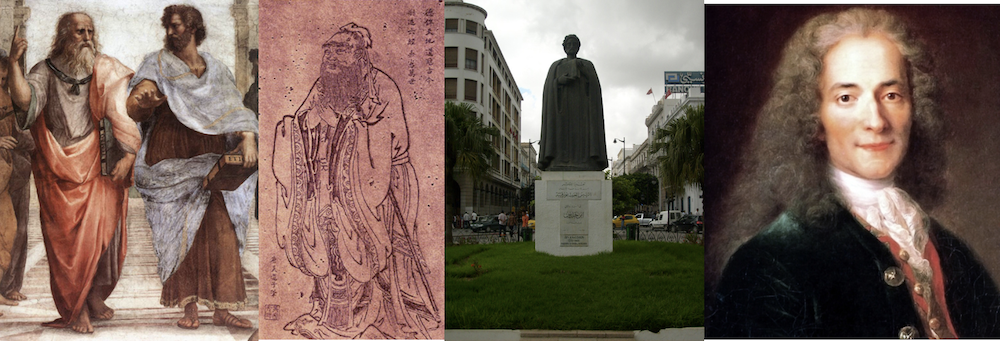
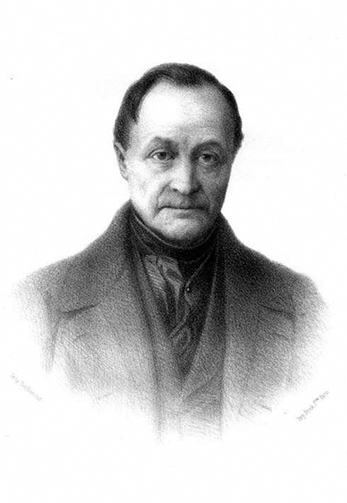
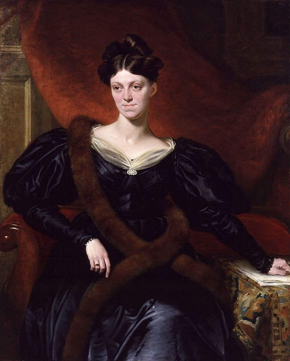
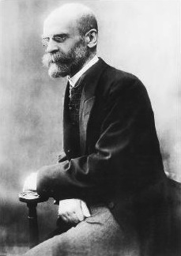
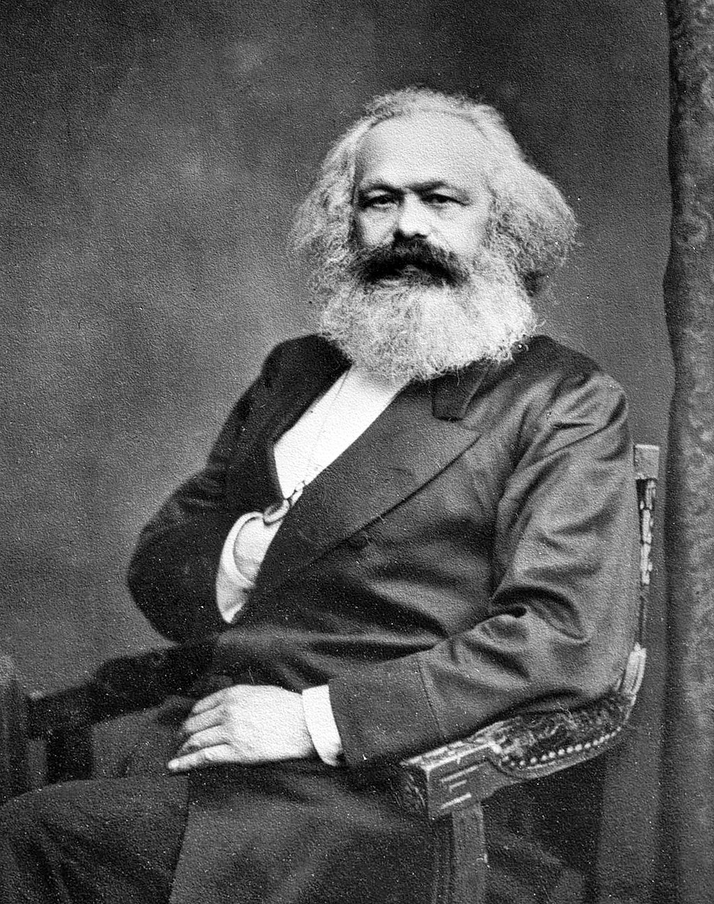
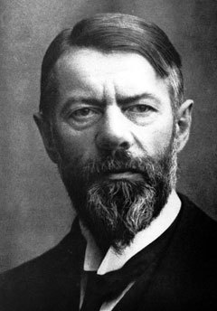
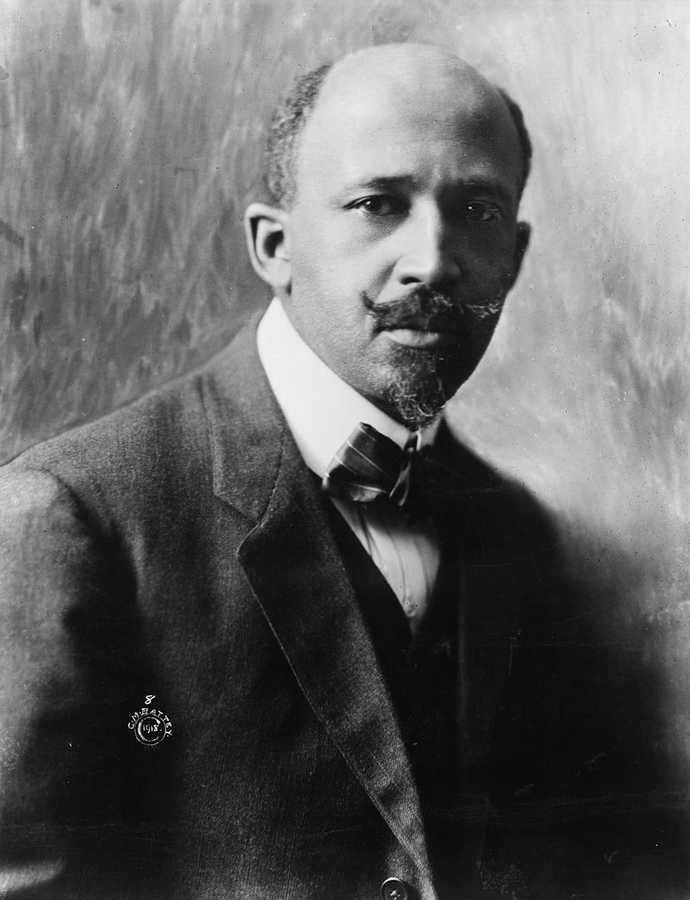

---

## Origins of Sociology
SOC100: Introduction to Sociology  
Brian McPhail  
Purdue University

---

Plato and Aristotle (382-322 BC), Confucius (581-479 BC), Khaldun (1332-1406), and Voltaire (1694-1778)
---

### Industrial Revolution

---
@snap[north span-100]
### Industrial Revolution
@snapend

@snap[west span-60]
The dramatic social changes of the Industrial Revolution (mid-1700s to mid-1800s) helped spark the development of the social sciences, as early sociological thinkers struggled with the vast implications of economic, social, and political revolutions.
@snapend

@snap[east span-40]

@snapend

---
@snap[north span-100]
### Auguste Comte (1798–1857)
@snapend

@snap[east span-30]

@snapend

@snap[west span-60]
@ul
- French philosopher
- coined the term *sociology*, which he saw as the scientific study of human behavior and society

@ulend
@snapend
---
@snap[north span-100]
### Auguste Comte (1798–1857)
@snapend

@snap[west span-100]
@ul
- believed that social scientists could study society using the same scientific methods utilized in natural sciences
- sought to understand how societies construct order out of chaos
- advocated for social planning to improve people's lives
@ulend
@snapend

---
@snap[north span-100]
### Harriet Martineau (1802–1876)
@snapend

@snap[east span-30]

@snapend

@snap[west span-70]
@ul
- English writer
- first woman sociologist
- first to translate Comte’s writing to English
- expanded sociological research to women, and neglected issues like marriage, children, race relations, and domestic and religious life
@ulend
@snapend
---
@snap[north span-100]
### Émile Durkheim (1858–1917)
@snapend

@snap[east span-30]

@snapend

@snap[west span-70]
@ul
- French social psychologist and philosopher
- established sociology as a scientific discipline by developing methodological principles that guide research in *Rules of the Sociological Method* (1895)
@ulend
@snapend

---
@snap[north span-100]
### Émile Durkheim (1858–1917)
@snapend

- **social facts**: “manners of acting, thinking, and feeling external to the individual, which are invested with a coercive power by virtue of which they exercise control over him”
  - aspects of social life that shape individual actions  

---
@snap[north span-100]
### Émile Durkheim (1858–1917)
@snapend

- Q: How do societies hold together?
  - A: Solidarity (social cohesion, social "glue")

- Earlier less complex societies are held together homogeneity & similarity, which Durkheim called **mechanical solidarity**.
- Societies characterized by mechanical solidarity share a very strong belief and moral structure.

---
@snap[north span-100]
### Émile Durkheim (1858–1917)
@snapend

- Increased specialization and differentiation leads to interdependence, cooperation, and shared values that he called **organic solidarity**.

- Society is like an organism, with specialized parts that work together as an integrated whole.

- **division of labor**: “…the specialization of work tasks by means of which different occupations are combined within a production system.”

---
@snap[north span-100]
### Émile Durkheim (1858–1917)
@snapend

- Q: How do societies exert control over people’s actions?
  - A: Social constraints (ways that society influences individual behavior)
- In times of rapid social change, social constraints can become weak, which can lead to **anomie**, a situation in which social norms lose their hold over individual behavior.
- *Suicide* (1897) examined anomie.
---
@snap[north span-100]
### Karl Marx (1818–1883)
@snapend

@snap[east span-30]

@snapend

@snap[west span-70]
@ul
- German economic, political, and social theorist
- coauthored the *Communist Manifesto* (1848) with Friedrich Engels (1820–1895)
- believed that societies grew and changed as a result of the struggles of different social classes over the means of production.
@ulend
@snapend
---
@snap[north span-100]
### Karl Marx (1818–1883)
@snapend

- In Marx's **materialist conception of history** material, or economic, factors have a primary role in determining historical change and the source of conflict in society.

- The Industrial Revolution and the rise of capitalism led to great disparities in wealth between the owners of the factories and workers.

---
@snap[north span-100]
### Karl Marx (1818–1883)
@snapend

- **capitalism**:
an economic system based on the private ownership of wealth, which is invested and reinvested in order to produce profit
  - capitalism -> conflict
- Because the rich exploit the poor and the poor seek ways to overcome that exploitation (i.e., revolt).

---
@snap[north span-100]
### Karl Marx (1818–1883)
@snapend

- predicted the collapse of capitalism, which would be replaced by **communism**, an economic system under which there is no private or corporate ownership (i.e., everything is owned communally and distributed as needed)
- believed that communism was a more equitable system than capitalism

---
@snap[north span-100]
### Max Weber (1864–1920)
@snapend

@snap[east span-30]

@snapend

@snap[west span-70]
@ul
- a German sociologist, philosopher, jurist, and political economist
- his ideas profoundly influenced social theory and social research
- believed values and ideas (not economics like Marx) were the impetus for social change
@ulend
@snapend

---
@snap[north span-100]
### Max Weber (1864–1920)
@snapend

- Studied the role religion played in the development of capitalism
- In *The Protestant Ethic and the Spirit of Capitalism* (1904), Weber argued that certain aspects of Christian beliefs and practices influenced the development of capitalism.

---
@snap[north span-100]
### Max Weber (1864–1920)
@snapend

- Observed that social, economic, and cultural life was becoming organized according to principles of efficiency, which he called the **rationalization of society**.
  - the process by which modes of precise calculation and organization, involving abstract rules and procedures, increasingly come to dominate the social world.

---
@snap[north span-100]
### Max Weber (1864–1920)
@snapend

- Out of rationalization came a new form of organization, the **bureaucracy**.
  - a type of organization marked by a clear hierarchy of authority and the existence of written rules of procedure and staffed by full-time, salaried officials.

---
@snap[north span-100]
### Max Weber (1864–1920)
@snapend

- the increased rationalization inherent in social life traps individuals in systems based purely on efficiency, rational calculation and control. He called this the "iron cage."
- also described the bureaucratization of social order as "the polar night of icy darkness"

---
@snap[north span-100]
### W. E. B. Du Bois (1868–1963)
@snapend

@snap[east span-30]

@snapend

@snap[west span-70]
@ul
- first African American to graduate from Harvard University
- was critical of Marx for having ignored the importance of race in an understanding of social inequality
@ulend
@snapend

---
@snap[north span-100]
### W. E. B. Du Bois (1868–1963)
@snapend

- argued that race was important determinant of social stratification in the US
- As an advocate of social reform, he was one of the founding members of the National Association for the Advancement of Colored People (NAACP).

---
@snapend
@snapend
